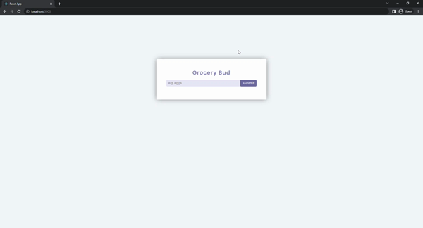

# Grocery Bud
The new item can be added to the list in this project. Also, any item can be edited or deleted. In the operation of editing, deleting, and the empty item adding, the alert appears on the list. When clicking on the "Clear Items" button, all list items delete.



## Used Technologies
* 

* 

* 

## Installation
First clone the project.
```
git clone https://github.com/saglamburcu/react-grocery-bud.git
```

## Usage
After cloning the project, open it in Visual Studio Code.
```
cd react-grocery-bud
code .
```
Download node modules to make it work
```
npm install
```
To make it work
```
npm start
```